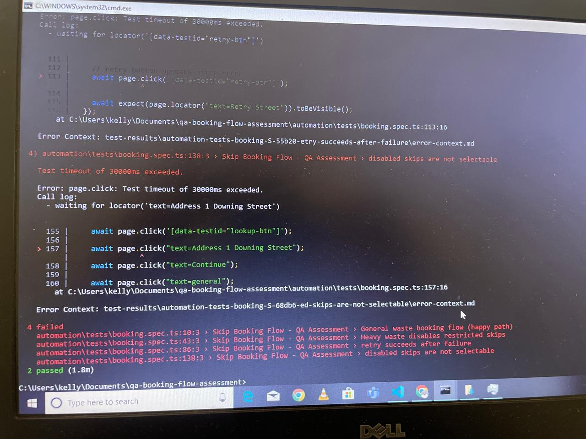
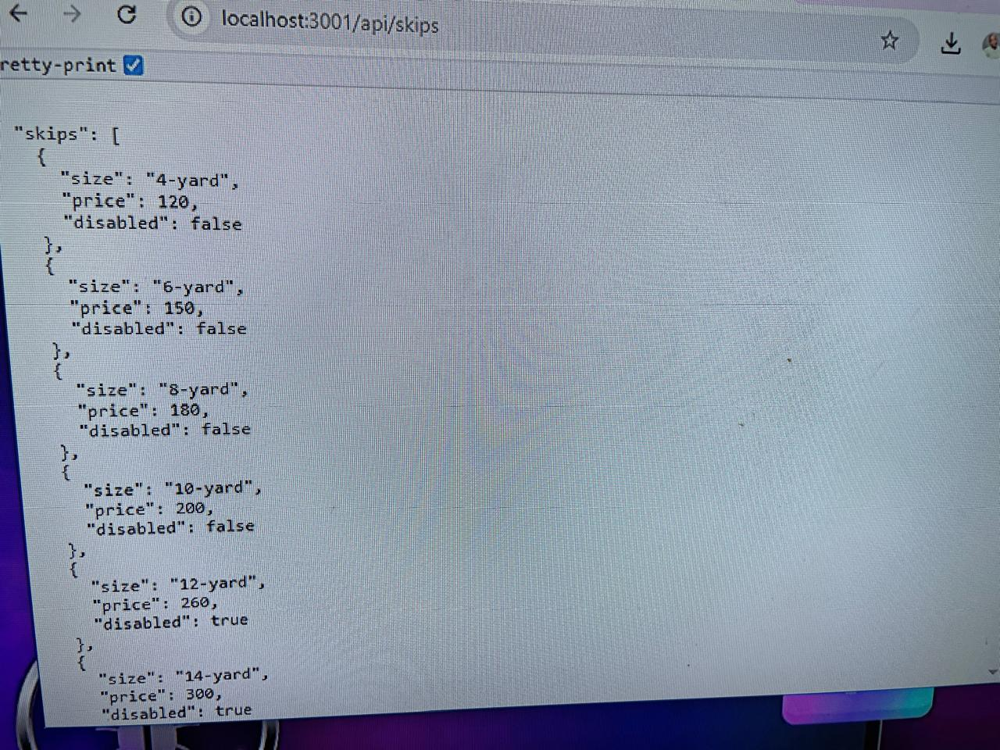
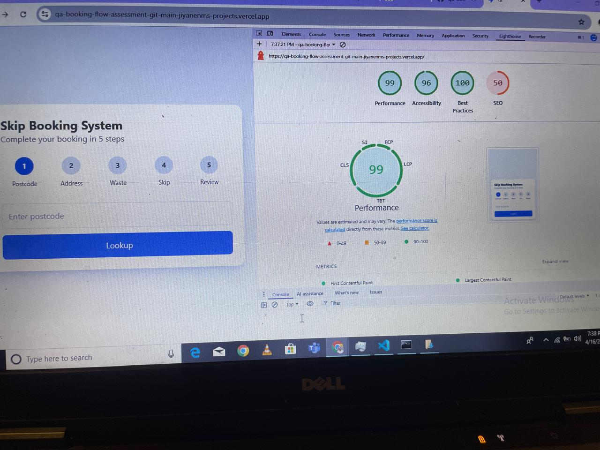
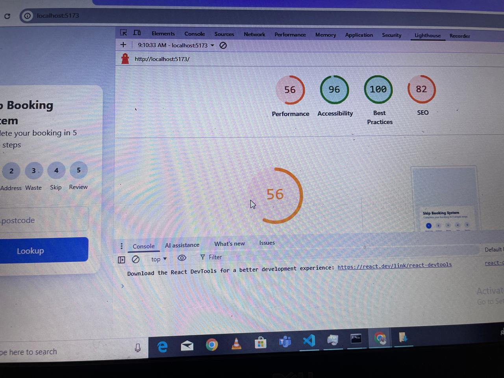

# QA Booking Flow Assessment

##  Live Demo
[Insert your deployed link here]

- Live UI Demo --> https://qa-booking-flow-assessment-git-main-jiyanenms-projects.vercel.app/
- Live API / Back End server --> https://qa-booking-flow-assessment.onrender.com/api/skips
- Clone Project -->  https://github.com/Jiyanenm/qa-booking-flow-assessment

##  Project Overview

This project is a multi-step booking flow application designed to simulate a real-world waste management booking system.

It includes:
- Dynamic UI with branching logic
- API-driven data handling
- Robust error, loading, and retry states
- Full QA coverage (manual + automation)

---

## AI Integration (NEW)

This project includes an **AI-ready architecture layer** that can be extended to enhance user experience.

### Current AI Capability (Design Ready)
The system is structured to support AI features such as:

- Smart postcode validation suggestions
- Waste type recommendation based on user selection
- Skip size optimization (cost vs capacity)
- Conversational booking assistant (chat-based UI extension)

### Example AI Use Cases (Future Enhancement)

- “What skip size do I need for a kitchen renovation?”
- Auto-suggest cheapest suitable skip
- Predict booking completion time
- Smart error explanations instead of static messages

### How AI would be added

AI layer can be integrated via:
- Node.js backend API (`/api/ai/recommendation`)
- OpenAI API (server-side only)
- Prompt-based recommendation engine
- Optional chat widget inside React UI

>  Important: Never expose API keys in frontend code. Use `.env` files on backend.

## Tech Stack

- VS Code - IDE
- React (Vite)
- Node.js (Express mock API)
- Playwright (E2E automation)
- Tailwind CSS
- Vercel - cloud platform optimized for frontend developers to build, deploy, and scale web applications.
- Render - Cloud platform to host APIs.

---

##  Features Implemented

### Step 1: Postcode Lookup
- UK postcode validation
- 12+ addresses (SW1A 1AA)
- Empty state (EC1A 1BB)
- Latency simulation (M1 1AE)
- Failure + retry (BS1 4DJ)

###  Step 2: Waste Type
- General, Heavy, Plasterboard
- Plasterboard branching logic (3 options)

###  Step 3: Skip Selection
- 8 skip options
- Disabled logic for heavy waste

###  Step 4: Review
- Full booking summary
- Price breakdown (incl. VAT)
- Double-submit prevention

---

##  Testing Strategy

### Manual Testing
- 35 test cases
- Includes:
  - Positive
  - Negative
  - Edge cases
  - API failures
  - State transitions

  ---Please referer to [text](manual-tests.md)

  ### Bug management 

---Please referer to bug-reports.md

### Automation
- Playwright E2E tests
- Covers:
  - Full booking flow
  - Heavy waste logic
  - API mocking (failures, retry, latency)

---!

##  Mock API Strategy

- Express-based mock server
- Deterministic fixtures:
  - SW1A 1AA → 12 addresses
  - EC1A 1BB → empty
  - M1 1AE → delayed response
  - BS1 4DJ → fail once then succeed

---!

##  UI/UX Considerations

- Mobile responsive layout
- Clear loading indicators
- Retry mechanisms
- Disabled state visibility
- Accessibility-friendly structure

# Desktop / Web
---!

# Mobile
---!

## Visual and performance testing

---!

# How to Run on cloud platform

 - Open the UI Link : https://qa-booking-flow-assessment-git-main-jiyanenms-projects.vercel.app/
 - Open the API Link : https://qa-booking-flow-assessment.onrender.com/

# How to Run Locally

1. installing dependencies

- npm install 

2. Run your UI application

- npm run dev

3. Run your API applications - Navigate into package root/ui

- node server.js

4. Run End To End Testing using playwright

- npm run test:e2e

