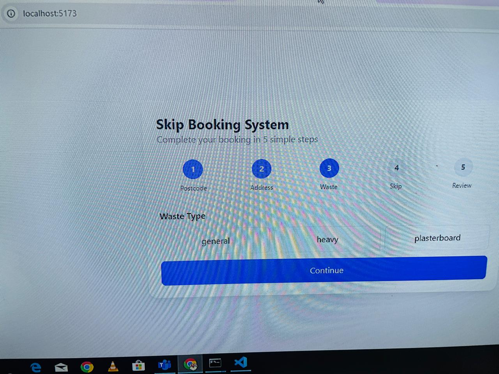
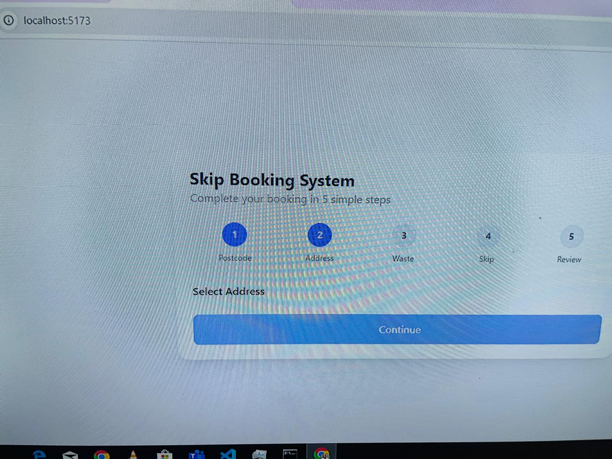
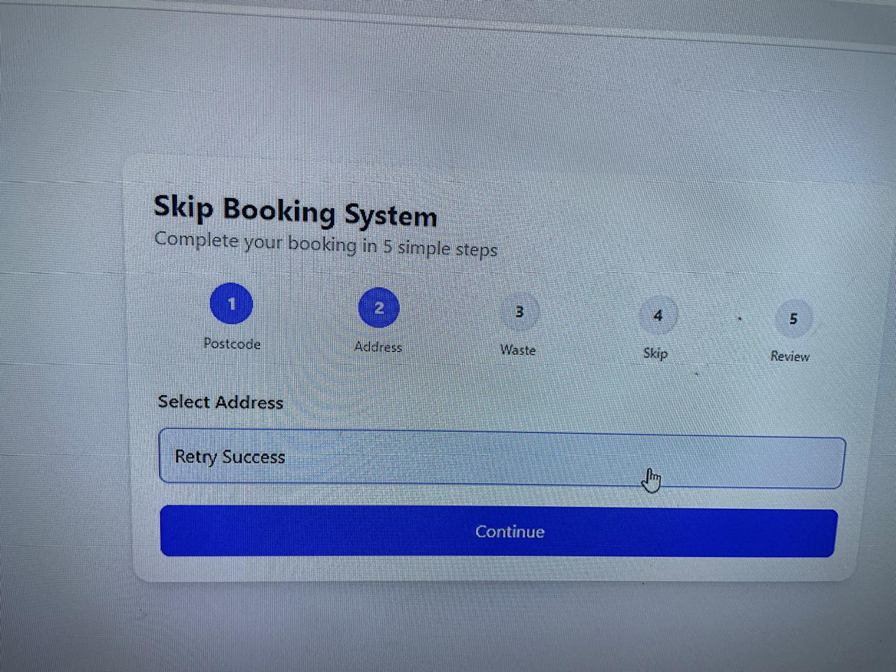

# Bug Reports

---

##  Bug 1: User cannot navigate back to previous steps (no backward navigation)

- **Severity:** Medium–High  
- **Priority:** High  
- **Environment:** Chrome, Desktop  
- **Type:** UX / Functional Gap  

### Steps to Reproduce:
1. Enter postcode `SW1A 1AA`
2. Select an address
3. Choose **General Waste**
4. Select a skip (e.g., 4-yard)
5. Go back to Step 2
6. Change to **Heavy Waste**
7. Proceed to Step 3
8. Attempt to go back to Step 2

### Expected Result:
User should be able to:

Navigate back to previous steps
Edit earlier selections (address, waste type, etc.)

### Actual Result:
 No back button available
 Stepper is not clickable
 User is locked into forward-only flow

### Impact:
Users cannot correct mistakes
Forces full restart of flow
Poor UX for real-world booking systems
Prevents testing of state transitions (important QA gap)

### Evidence:
(Screenshot showing disabled skip still selected)

---

##  Bug 2: Invalid postcode input is not validated and allows user to proceed to address step

- **Severity:** High  
- **Priority:** High  
- **Type:** Validation / Functional 
- **Environment:** Browser: Chrome (latest), Device: Desktop, App: Booking Flow (Localhost)
- **Preconditions:** User is on Step 1 (Postcode entry)

### Steps to Reproduce:
1. Enter an invalid postcode (e.g., 123, ABC, or empty spaces)
2. Click Lookup

### Expected Result:
- Postcode should be validated against UK format (e.g., SW1A 1AA)
- User should see validation error:
“Enter a valid UK postcode”
- API request should NOT be triggered
- User should remain on Step 1

### Actual Result:
- No validation performed
- API request is triggered
- App proceeds to Step 2 (Address step)
- May show empty or inconsistent results

### Impact:
- Invalid data sent to backend
- Poor data integrity
- Confusing UX (empty address list)
- Breaks deterministic fixture expectations

### Evidence:
(Screenshot or network tab showing multiple POST requests)

--- 

##  Bug 3: Addresses not displayed after entering valid postcode

- **Severity:** High  
- **Priority:** High  
- **Feature:** Postcode Lookup → Address Selection

### Steps to Reproduce:
1. Enter postcode `BS1 4DJ`
2. Click Lookup (first call fails)

### Expected Result:
A list of addresses should be displayed

### Actual Result:
App moves to Address step
No addresses are shown

### Impact:
User gets stuck and cannot recover without refreshing page.

### Evidence:
(Screenshot showing error without retry button)

-- 